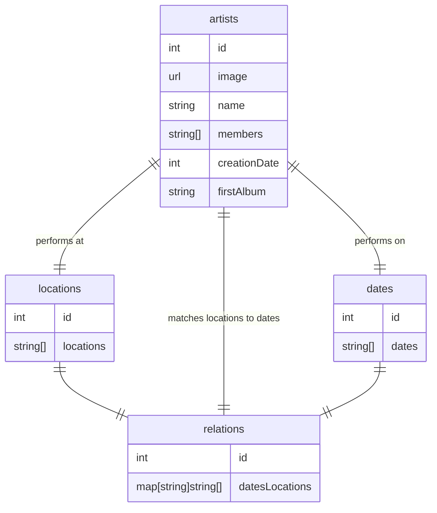

# groupie-tracker

## Requirements
- user friendly site to display band info
    - multiple visualization? mimic display in file explorer? different level of info
    - display by artist? location? dates?
- event/action (client call)
    - switch between visualization? display different info
    - event run asynchronous
- backend in GO
- must use artists, locations, dates and relations from api
- error page and handling
- can't crash at any time
- host it on github?

## steps
1. send request to api
2. open response from api
3. decode JSON
4. display data from api

## optionals
- filters (BACK-END 30%.required to start FORUM)
- visualization (BACK-END 35%)
- geolocalization (BACK-END 15%)
- search-bar (BACK-END 10%)

## Tasks
- Sanitize input from api
- check api data
- proper display of artist page
- responsiveness
