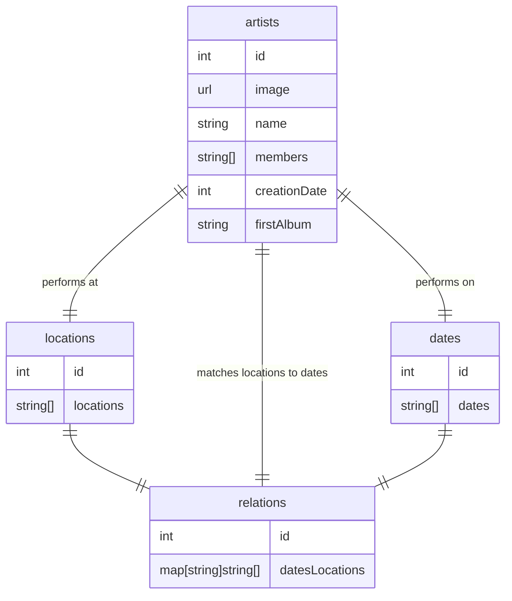

# groupie-tracker

## Requirements
- user friendly site to display band info
    - multiple visualization? mimic display in file explorer? different level of info
    - display by artist? location? dates?
- event/action (client call)
    - switch between visualization? display different info
    - event run asynchronous
- backend in GO
- must use artists, locations, dates and relations from api
- error page and handling
- can't crash at any time
- host it on github?

## optionals
- filters (BACK-END 30%.required to start FORUM)
- visualization (BACK-END 35%)
- geolocalization (BACK-END 15%)
- search-bar (BACK-END 10%)

## Tasks
- vlidate data from api (Anass)
- Sanitize data from api (Anass)
    - use dates to calculate number of performances
    - use location to calculate number pf countries performed in
- sorting of list

- index page. Display: (Allen)
    - image
    - name
    - creation date
    - first album
    - number of members 
    - (number of performances? number of countries performed in?)
- dropdown list to select sorting criteria and order (Allen)
- band's bio: display all info (Allen)
- responsiveness (Allen)

filters: (Anass)
- filter by creation date
- first album
- number of members
- locations of concerts
- a range filter
- a checkbox filter
- we can implement this early and use it to fulfill the requirement of using all four sets of data

visulizations: (Allen?)
- manipulating the data and displaying it in the most presentable way possible to you
- Schneiderman's 8 Golden Rules of Interface Design
    - strive for consistency
    - enable frequent users to use shortcut
    - offer informative feedback
    - design dialogue to yield closure
    - offer simple error handling
    - permit easy reversal of actions
    - support internal locus of control
    - reduce shirt-term memory load