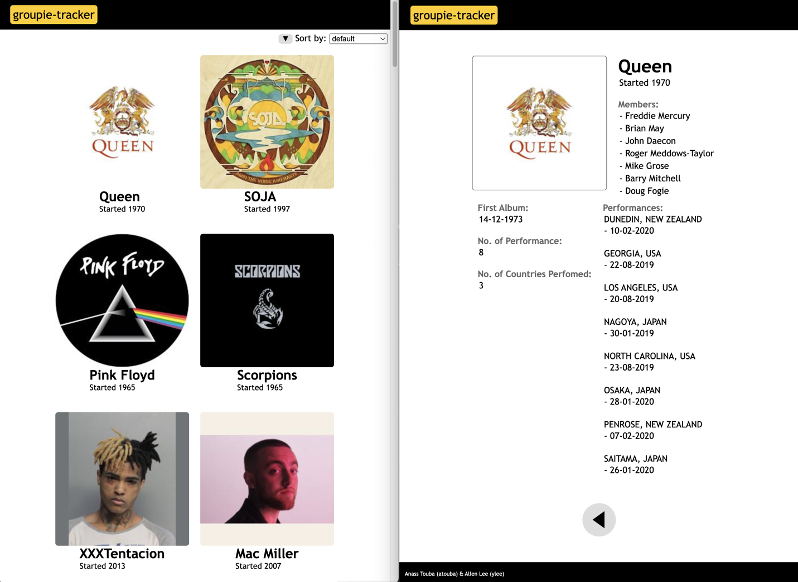
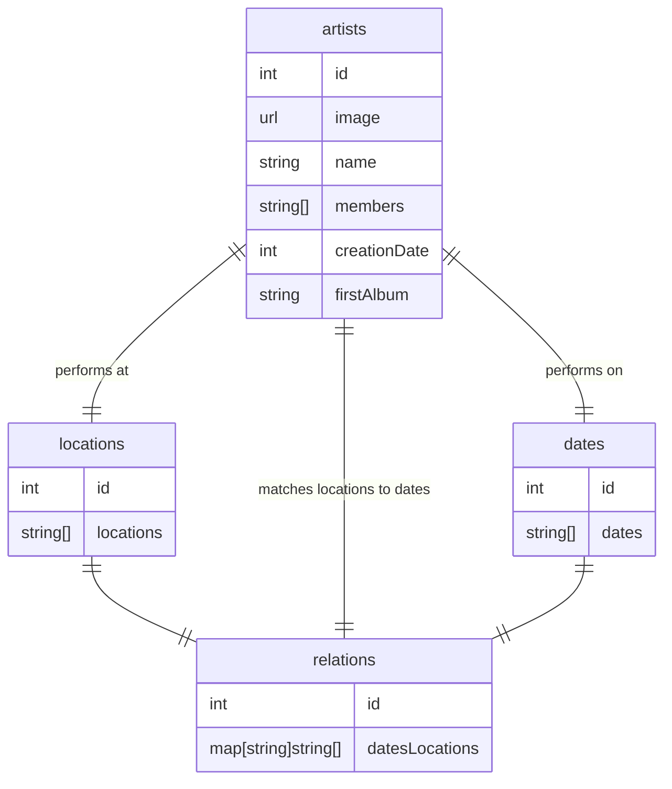
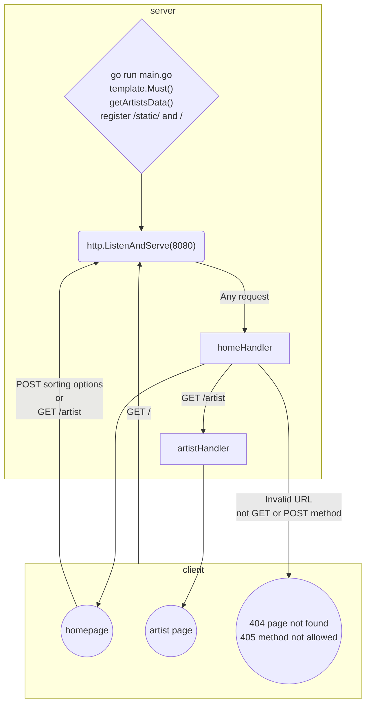

# groupie-tracker
By: Allen Lee (ylee) & Anass Touba (atouba)

groupie-tracker presents bands info from `https://groupietrackers.herokuapp.com/api` in a user friendly web page.
In the homepage, user can see the list of bands. Clicking on one will bring users to the artist's page displaying more detailed info.

## Usage
Prerequisites: 
- golang version 1.22.6 
- git version 2.46.0

Download the project using `git clone https://01.gritlab.ax/git/ylee/groupie-tracker.git`. Navigate to the project folder in the terminal and start the server by entering `go run main.go`. Key in a valid URL `localhost:8080/` in a browser and find your favourite band.

## Implementation

Below is an entity chart to show how the data relates to one another.

Here is how the program flows.

1. When the program is starts running, 
	- it grabs the templates and artistData `getArtistsData()`
	- it registers the `/` amd `/static/` as valid URLs
	- it listens to the assigned port for requests.
2. All request (other than `/static/`) will be pass to `homeHandler` function.
    - if `GET /`, response with homepage (indexTmpl)
3. From the homepage, users can:
    - change sorting options. Generates a `POST` request
    - click on an artist's thumbnail. Generates a `GET /artist`
4. `POST sorting options` are handled by `getSortedArtists()`
5. `GET /artist` are handled by `artistHandler` (artistTmpl)
6. When an error is encounterd, errTmpl is used to generate the html response

Deployed server/site using Render

## optionals
- filters (BACK-END 30%.required to start FORUM)
- visualization (BACK-END 35%)
- geolocalization (BACK-END 15%)
- search-bar (BACK-END 10%)

## filters: (Anass)
- filter by creation date
- first album
- number of members
- locations of concerts
- a range filter
- a checkbox filter
- we can implement this early and use it to fulfill the requirement of using all four sets of data

